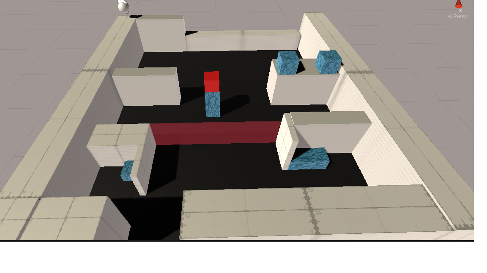

# GDW2021
  GWD2021 is a Summer game development workshop led by the officers of the Game Development Club at San Jose State University.
  * You are put into a team
  * Create a design document 
  * Begin pre-production
  * Develop in a 4 week time span using SCRUM framework
  * upload your game to itch.io
## Table Of Contents
1. [Overview](#Overview)
2. [Screenshots](#Screenshots)
3. [Demo](#Demo)

Authors: Ryan Kwong, Thomas Lao, Koshi Huynh

### Overview
 
This game is a 3D puzzle platformer put together by 3 programmers: Ryan Kwong, Thomas Lao, Koshi Huynh. We worked on this game for 4 weeks and it turned out quite well/
The game is designed to put the player in the position of Jack and the Bean stalk as he attempts to raid god's vault. 

  
### Description

You play as Hermes, an infamous magical artifact hunter who is attempting to sneak into heaven and steal God's treasure. 
Make your way through dangerous puzzles and various terrains as you face the obstacles guarding the vault. 
Can you live up to your namesake, the god of thieves, or will your greed be your ultimate downfall?  

### Screenshots

 
### Demo

https://rykwong.itch.io/hermes

